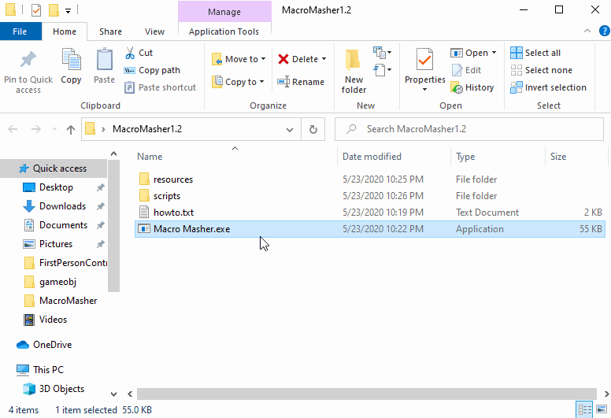
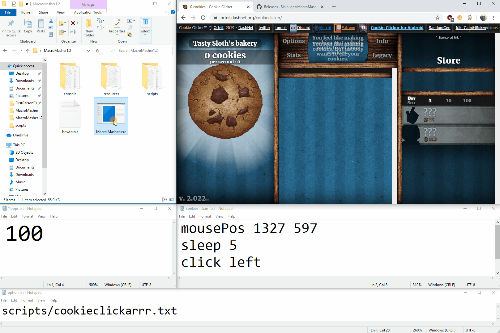

A small application to take in text files as commands and replicate human input for Windows.

## Usage example

You could write a set of inputs to open an application and configure it accordingly.
You could use the application as a TAS tool.
You could use the tool as a way to give instructions on how to do something. (such as create a new file or locate a directory to go to)
My friend actually used it to send a discord message every 5 minutes on a 'cookie clicker' like bot system.
You could write a quick macro to give you cookies in cookie clicker.

# Usage Gifs

## Development setup

SFML Library setup
Visual Studio 2019

## Release History

* 1.2
    * Brought back SFML for highest compatibility
    * Stable version for potential use in a graphical version
* 1.1
    * Added functionality to type full words
    * Removed SFML dependency
    * Added looping
* 1.0
    * Working release, simple macro

## Meta

Matthew Periut – [@Matthew_periut](https://twitter.com/matthew_periut) – matthewperiut@gmail.com

Distributed under the MIT license. See [here](https://en.wikipedia.org/wiki/MIT_License) for more information.

https://github.com/Slainlight/MacroMasher

